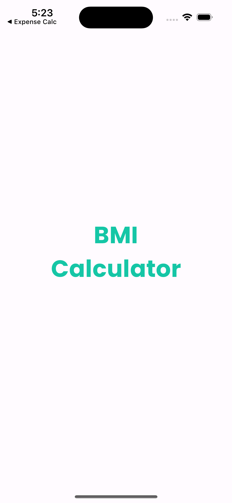
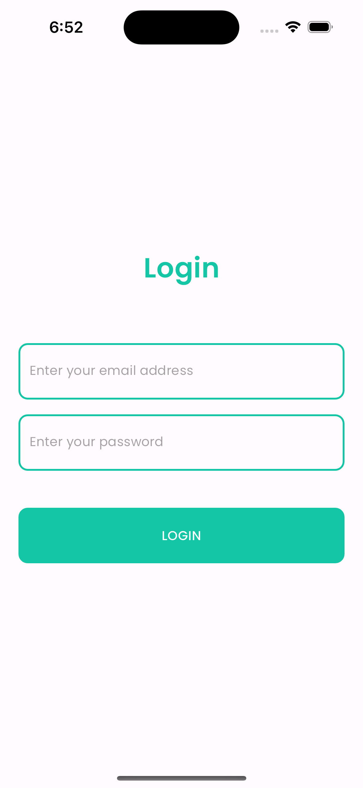
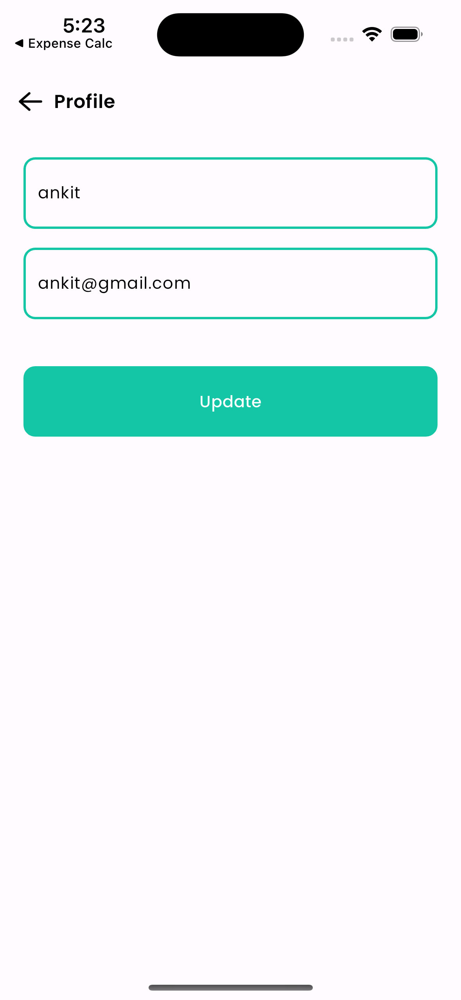
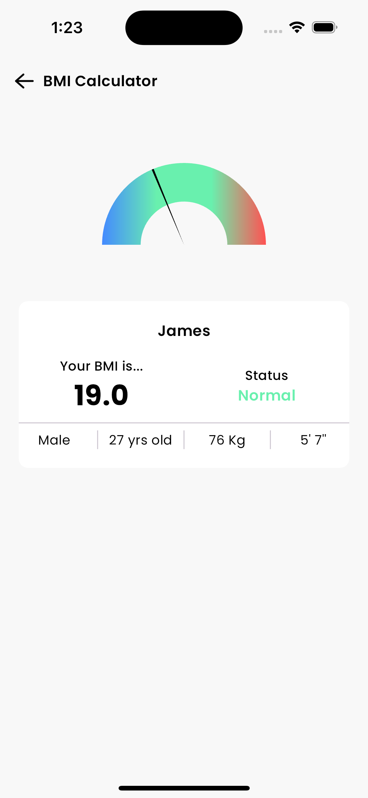
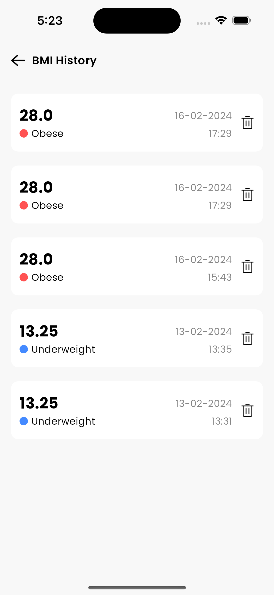

# Flutter BMI Calculator
## Overview
This Flutter BMI Calculator is a mobile application designed to help users track their Body Mass Index (BMI) conveniently. It offers a seamless user experience with features like BMI calculation, viewing results, and accessing BMI history. The application utilizes Firebase Firestore for storing user details and BMI data securely. GetX is used for efficient state management in this app.

## Features
#### Authentication
* Users can sign up and log in securely to access the BMI calculator functionalities.

#### Profile Management
* Users can update their personal details like name, age, weight, and height.
* Profile management allows users to keep their information up-to-date for accurate BMI calculations.

#### BMI Calculator
* Users can input their measurements, including weight and height.
* The calculator then computes the BMI based on the provided information.

#### Result Display
* After inputting measurements, users can view their BMI status and corresponding category (underweight, normal weight, overweight, or obese).
* The application provides clear and concise results for easy interpretation.

#### BMI History
* Users can access their past BMI records for tracking their progress over time.
* BMI history enables users to monitor changes in their BMI and make informed decisions regarding their health and fitness goals.

## Technology Stack
* Flutter: Cross-platform framework for building mobile applications.
* GetX: State management solution for Flutter, providing simple and reactive state management.
* Firebase Firestore: Cloud-hosted NoSQL database for storing user data securely.

## Getting Started
* 		Clone the repository: git clone https://github.com/himanshu077/bmi-calculator.git
* 		Navigate to the project directory: cd bmi-calculator
* 		Install dependencies: flutter pub get
* Configure Firebase:

    1. Create a Firebase project at Firebase Console
    2. Enable Firestore and Firebase Authentication services
    3. Download and add google-services.json to the android/app directory for Android, and GoogleService-Info.plist to the ios/Runner directory for iOS.
* 		Run the app: flutter run

You can download the apk from the [link](https://drive.google.com/file/d/1l0XO5rj_if0-M7QYy2nNc4Z_uxZFpMyt/view?usp=sharing)

## Screen shots
    

